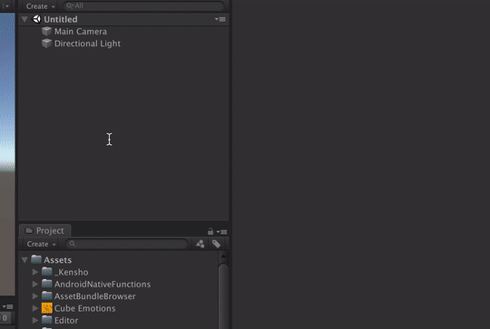

# git-unity-clean



This is a git extension to clean changes that unity makes after opening fresh cloned project. The main goal is to solve problem with meta files. When you have an empty directory this directory won't be saved in git and won't be restored by git clone as well. So, Unity removes meta files for missing empty directories. You may choose to commit such changes. But other team member may have such directories in their local copies. So, when they pull your changes Unity creates meta files again and they will commit them. Your git history will be full of such trash changes. Another option is to create empty directories for removed meta files. But manual restore of such directories is kind of pain. This script will do all the work. Also it discards changes in assets that can be modified and remove weird generated assets such as No Name.mat on the first project opening.

The script was tested in macOS terminal and in Windows git-bash terminal (shipped with Git for Windows, based on mingw).

### How to use

All you need is to put git-unity-clean to some directory from the list of PATH variable.
For macOS it can be /usr/local/bin
For Windows add some your directory with the script to system environmet PATH

After you open just cloned Unity project and git will show you changes you can open terminal and call
```
git unity-clean
```

To see what the script is going to do without making changes call it with ```--dry-run``` (or short ```-n```)
```
git unity-clean --dry-run
```

Note that changes should not be staged because the script skips staged chages.
Don't forget that the script should have execution permission on macOS and Linux (the permission is already in git just to note).
